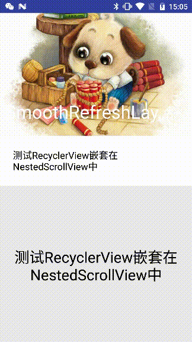
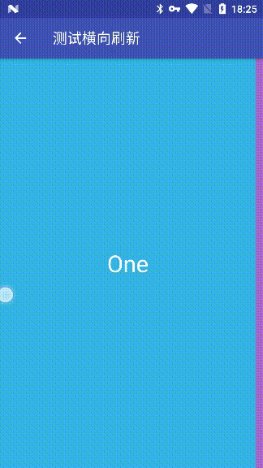
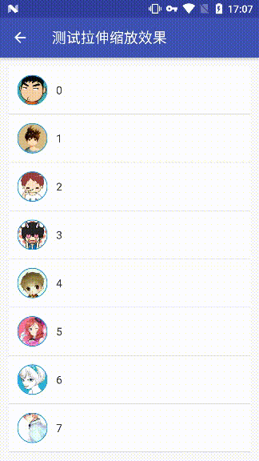

# SmoothRefreshLayout

[](https://bintray.com/dkzwm/maven/core)

[](https://developer.android.com/about/versions/android-4.0.html)
[](https://github.com/dkzwm/SmoothRefreshLayout/blob/master/LICENSE)

## [English](README_EN.md) | 中文
一个高效的Android刷新库，理论上支持所有的视图，比官方的SwipeRefreshLayout更强大且使用方便.    
## 特性:
 - 理论上支持所有的视图,且可根据具体需求高效适配.
 - 支持多点触摸.
 - 支持嵌套滑动,完整实现了NestedScrollingChild3，NestedScrollingParent3 接口,玩转CoordinatorLayout.
 - 直接继承自ViewGroup,拥有卓越的性能,支持类FameLayout的特性（Gravity、Margin).
 - 支持自动刷新、自动上拉加载、到底自动加载更多（不推荐，建议使用Adapter实现，可自定义到底判断逻辑回调实现预加载更多）.
 - 支持越界回弹.
 - 支持刷新视图自定样式:STYLE_DEFAULT(默认不改变大小)、STYLE_SCALE(动态改变大小，会在SRL内部测量并布局，所以性能会有损失)、STYLE_PIN(不会改变视图大小，固定在顶部或者底部)、STYLE_FOLLOW_SCALE(先纵向跟随移动并且不改变视图大小，大于视图高度后动态改变视图大小且性能会有损失)、STYLE_FOLLOW_PIN(不会改变视图大小，先纵向跟随移动，大于视图高度后固定)、STYLE_FOLLOW_CENTER(不会改变视图大小，先纵向跟随移动，大于视图高度后让视图保持在移动的距离中心点).
 - 支持二级刷新事件（TwoLevelSmoothRefreshLayout）,PS:淘宝二楼、京东活动.
 - 支持横向刷新(HorizontalSmoothRefreshLayout).
 - 支持ListView、GridView、RecyclerView加载更多的同步平滑滚动.
 - 支持手势:同步Fling(刷新视图仍可见的情况下,会先回滚隐藏刷新视图,而后向下传递Fling手势).
 - 支持作为可拉伸内部视图布局使用（类小米设置页效果）.
 - 丰富的回调接口和调试信息,可利用现有API实现丰富的效果.

## 引入
添加如下依赖到你的 build.gradle 文件:
```
dependencies {
    implementation 'me.dkzwm.widget.srl:core:1.7.0.androidx'
    implementation 'me.dkzwm.widget.srl:ext-util:1.7.0.androidx'
    implementation 'me.dkzwm.widget.srl:ext-material:1.7.0.androidx'
    implementation 'me.dkzwm.widget.srl:ext-horizontal:1.7.0.androidx'
    implementation 'me.dkzwm.widget.srl:ext-classics:1.7.0.androidx'
    implementation 'me.dkzwm.widget.srl:ext-two-level:1.7.0.androidx'

    //android support 最终版本
    implementation 'me.dkzwm.widget.srl:core:1.6.6.8'
    implementation 'me.dkzwm.widget.srl:ext-util:1.6.6.8'
    implementation 'me.dkzwm.widget.srl:ext-material:1.6.6.8'
    implementation 'me.dkzwm.widget.srl:ext-horizontal:1.6.6.8'
    implementation 'me.dkzwm.widget.srl:ext-classics:1.6.6.8'
    implementation 'me.dkzwm.widget.srl:ext-two-level:1.6.6.8'
}
```

## 演示程序
下载 [Demo.apk](https://raw.githubusercontent.com/dkzwm/SmoothRefreshLayout/master/apk/demo.apk)    
## 更新日志
#### 老版本升级务必查看
 [更新日志](ext/UPDATE.md) 
## 快照    


----


---- 


## 使用   
#### 在Xml中配置
```
<?xml version="1.0" encoding="utf-8"?>
<me.dkzwm.widget.srl.SmoothRefreshLayout
	xmlns:android="http://schemas.android.com/apk/res/android"
	xmlns:app="http://schemas.android.com/apk/res-auto"
	android:id="@+id/refreshLayout"
	android:layout_width="match_parent"
	android:layout_height="match_parent">
	<TextView
		android:layout_width="match_parent"
		android:layout_height="match_parent"/>
</me.dkzwm.widget.srl.SmoothRefreshLayout>
```
####  Java代码配置
```
SmoothRefreshLayout refreshLayout = (SmoothRefreshLayout)findViewById(R.id.smoothRefreshLayout);
refreshLayout.setHeaderView(new ClassicHeader(this));
refreshLayout.setOnRefreshListener(new RefreshingListenerAdapter() {
	@Override
	public void onRefreshing() {
		mHandler.postDelayed(new Runnable() {
			@Override
			public void run() {
				refreshLayout.refreshComplete();
			}
		}, 4000);
	}
});
```
#### 自定义刷新视图
##### 接口定义
```
public interface IRefreshView <T extends IIndicator> {    

    byte TYPE_HEADER = 0;
    byte TYPE_FOOTER = 1;

    byte STYLE_DEFAULT = 0;
    byte STYLE_SCALE = 1;
    byte STYLE_PIN = 2;
    byte STYLE_FOLLOW_SCALE = 3;
    byte STYLE_FOLLOW_PIN = 4;
    byte STYLE_FOLLOW_CENTER = 5;

    /**
     * 返回是头部视图还是尾部视图;
     */
    int getType();

    /**
     * 一般情况都是View实现本接口，所以返回this;
     */
    View getView();

    /**
     * 获取视图样式，自1.4.8版本后支持6种样式，STYLE_DEFAULT、STYLE_SCALE、STYLE_PIN、STYLE_FOLLOW_SCALE、STYLE_FOLLOW_PIN、STYLE_FOLLOW_CENTER;
     */
    int getStyle();

    /**
     * 获取视图的自定义高度，当视图样式为STYLE_SCALE和STYLE_FOLLOW_SCALE时，必须返回一个确切且大于0的值，使用横向刷新库时，该属性实际应该返回的是视图的宽度;
     * 自1.6.1版本开始，如果想要当前视图铺满布局即MATCH_PARENT，那么支持返回ViewGroup.LayoutParams.MATCH_PARENT对应的值即`-1`;
     */
    int getCustomHeight();

    /**
     * 手指离开屏幕;
     */
    void onFingerUp(SmoothRefreshLayout layout, T indicator);

    /**
     * 重置视图;
     */
    void onReset(SmoothRefreshLayout layout);

    /**
     * 重新配置视图，准备刷新;
     */
    void onRefreshPrepare(SmoothRefreshLayout layout);

    /**
     * 开始刷新;
     */
    void onRefreshBegin(SmoothRefreshLayout layout, T indicator);

    /**
     * 刷新完成;
     */
    void onRefreshComplete(SmoothRefreshLayout layout,boolean isSuccessful);

    /**
     * 当头部或者尾部视图发生位置变化;
     */
    void onRefreshPositionChanged(SmoothRefreshLayout layout, byte status, T indicator);

    /**
     * 当头部或者尾部视图仍然处于处理事务中，这时候移动其他刷新视图则会调用该方法;
     * 在1.4.6版本新加入;
     */
    void onPureScrollPositionChanged(SmoothRefreshLayout layout, byte status, T indicator);
}
```

##### 添加自定义刷新视图
- 全局静态代码构造    
```    
        SmoothRefreshLayout.setDefaultCreator(new IRefreshViewCreator() {
            @Override
            public IRefreshView<IIndicator> createHeader(SmoothRefreshLayout layout) {
                ClassicHeader header = new ClassicHeader(layout.getContext());
                return header;
            }

            @Override
            public IRefreshView<IIndicator> createFooter(SmoothRefreshLayout layout) {
                ClassicFooter footer = new ClassicFooter(layout.getContext());
                return footer;
            }
        });
```   

- 动态代码添加   
```    
        ClassicHeader header = new ClassicHeader(mRefreshLayout.getContext());
        mRefreshLayout.setHeaderView(header);
        ClassicFooter footer = new ClassicFooter(mRefreshLayout.getContext());
        mRefreshLayout.setFooterView(footer);
```    

- 请直接写入Xml文件,SmoothRefreshLayout会根据添加的View是否是实现了IRefreshView接口进行判断
 
#### 实现类QQ下拉阻尼效果
 ```
        mRefreshLayout.setIndicatorOffsetCalculator(new IIndicator.IOffsetCalculator() {
            @Override
            public float calculate(@IIndicator.MovingStatus int status, int currentPos, float offset) {
                if (status == IIndicator.MOVING_HEADER) {
                    if (offset < 0) {
                        //如果希望拖动缩回时类似QQ一样没有阻尼效果，阻尼效果只存在于下拉则可以在此返回offset
                        //如果希望拖动缩回时类似QQ一样有阻尼效果，那么请注释掉这个判断语句
                        return offset;
                    }
                    return (float) Math.pow(Math.pow(currentPos / 2, 1.28d) + offset, 1 / 1.28d) * 2 - currentPos;
                } else if (status == IIndicator.MOVING_FOOTER) {
                    if (offset > 0) {
                        //如果希望拖动缩回时类似QQ一样没有阻尼效果，阻尼效果只存在于上拉则可以在此返回offset
                        //如果希望拖动缩回时类似QQ一样有阻尼效果，那么请注释掉这个判断语句
                        return offset;
                    }
                    return -((float) Math.pow(Math.pow(currentPos / 2, 1.28d) - offset, 1 / 1.28d) * 2 - currentPos);
                } else {
                    if (offset > 0) {
                        return (float) Math.pow(offset, 1 / 1.28d) * 2;
                    } else if (offset < 0) {
                        return -(float) Math.pow(-offset, 1 / 1.28d) * 2;
                    } else {
                        return offset;
                    }
                }
            }
        });
 ```
#### Xml属性 
##### SmoothRefreshLayout 自身配置
|名称|类型|描述|
|:---:|:---:|:---:|
|sr_content|reference|指定内容视图的资源ID|
|sr_resistance|float|移动刷新视图时候的移动阻尼（默认:`1.65f`）|
|sr_resistanceOfFooter|float|移动Footer视图时候的移动阻尼（默认:`1.65f`）|
|sr_resistanceOfHeader|float|移动Header视图时候的移动阻尼（默认:`1.65f`）|
|sr_ratioToRefresh|float|触发刷新时位置占刷新视图的高度比（默认:`1f`）|
|sr_ratioOfHeaderToRefresh|float|触发刷新时位置占Header视图的高度比（默认:`1f`）|
|sr_ratioOfFooterToRefresh|float|触发加载更多时位置占Footer视图的高度比（默认:`1f`）|
|sr_ratioToKeep|float|刷新中保持视图位置占刷新视图的高度比（默认:`1f`）,该属性的值必须小于等于触发刷新高度比才会有效果|
|sr_ratioToKeepHeader|float|刷新中保持视图位置占Header视图的高度比（默认:`1f`）,该属性的值必须小于等于触发刷新高度比才会有效果|
|sr_ratioToKeepFooter|float|刷新中保持视图位置占Footer视图的高度比（默认:`1f`）,该属性的值必须小于等于触发刷新高度比才会有效果|
|sr_maxMoveRatio|float|最大移动距离占刷新视图的高度比（默认:`0f`，表示不会触发）|
|sr_maxMoveRatioOfHeader|float|最大移动距离占Header视图的高度比（默认:`0f`，表示不会触发）|
|sr_maxMoveRatioOfFooter|float|最大移动距离占Footer视图的高度比（默认:`0f`，表示不会触发）|
|sr_closeDuration|integer|指定收缩刷新视图到起始位置的时长（默认:`350`）|
|sr_closeHeaderDuration|integer|指定收缩Header视图到起始位置的时长（默认:`350`）|
|sr_closeFooterDuration|integer|指定收缩Footer视图到起始位置的时长（默认:`350`）|
|sr_backToKeepDuration|integer|设置回滚到保持刷新视图位置的时间（默认:`200`）|
|sr_backToKeepHeaderDuration|integer|设置回滚到保持Header视图位置的时间（默认:`200`）|
|sr_backToKeepFooterDuration|integer|设置回滚到保持Footer视图位置的时间（默认:`200`）|
|sr_enablePinContent|boolean|固定内容视图（默认:`false`）|
|sr_enableKeep|boolean|刷新中保持视图停留在所设置的应该停留的位置（默认:`true`）|
|sr_enablePullToRefresh|boolean|拉动刷新,下拉或者上拉到触发刷新位置即立即触发刷新（默认:`false`）|
|sr_enableOverScroll|boolean|越界回弹（默认:`true`）|
|sr_enableRefresh|boolean|设置是否启用下拉刷新（默认:`ture`）|
|sr_enableLoadMore|boolean|设置是否启用加载更多（默认:`false`）|
|sr_headerBackgroundColor|color|设置Header刷新高度区域的背景色|
|sr_footerBackgroundColor|color|设置Footer刷新高度区域的背景色|
|sr_mode|enum|模式设置（默认:`MODE_DEFAULT`为刷新控件模式）|
|sr_stickyHeader|reference|指定黏贴头部的资源ID|
|sr_stickyFooter|reference|指定黏贴尾部的资源ID|

##### TwoLevelSmoothRefreshLayout 自身配置
|名称|类型|描述|
|:---:|:---:|:---:|
|sr_enableTwoLevelRefresh|boolean|设置是否启用二级刷新（默认:`true`）|
|sr_backToKeep2Duration|boolean|设置回滚到保持二级刷新头部处于二级刷新过程中的时长（默认:`500`）|
|sr_closeHeader2Duration|boolean|设置关闭二级刷新头部的时长（默认:`500`）|

##### SmoothRefreshLayout包裹内部其他View支持配置
|名称|类型|描述|
|:---:|:---:|:---:|
|layout_gravity|flag|指定其它被包裹视图的对齐属性(非 targetView、非refreshView)|

#### SmoothRefreshLayout java属性设置方法
|名称|参数|描述|
|:---:|:---:|:---:|
|setHeaderView|IRefreshView|配置头部视图|
|setFooterView|IRefreshView|配置尾部视图|
|setContentView|View|配置内容视图|
|setMode|int|配置当前模式|
|setDisableWhenAnotherDirectionMove|boolean|内部视图含有其他方向滑动视图时需设置该属性为ture（默认:`false`）|
|setEnableNextPtrAtOnce|boolean|刷新完成即可再次刷新|
|setMaxOverScrollDuration|int|设置越界回弹动画最长时间（默认:`350`）|
|setMinOverScrollDuration|int|设置越界回弹动画最短时间（默认:`100`）|
|setResistance|float|移动刷新视图时候的移动阻尼（默认:`1.65f`）|
|setResistanceOfFooter|float|移动Footer视图时候的移动阻尼（默认:`1.65f`）|
|setResistanceOfHeader|float|移动Header视图时候的移动阻尼（默认:`1.65f`）|
|setRatioToRefresh|float|触发刷新时位置占刷新视图的高度比（默认:`1.1f`）|
|setRatioOfHeaderToRefresh|float|触发刷新时位置占Header视图的高度比（默认:`1.1f`）|
|setRatioOfFooterToRefresh|float|触发加载更多时位置占Footer视图的高度比（默认:`1.1f`）|
|setRatioToKeep|float|刷新中保持视图位置占刷新视图的高度比（默认:`1f`）,该属性的值必须小于等于触发刷新高度比才会有效果|
|setRatioToKeepHeader|float|刷新中保持视图位置占Header视图的高度比（默认:`1f`）,该属性的值必须小于等于触发刷新高度比才会有效果|
|setRatioToKeepFooter|float|刷新中保持视图位置占Footer视图的高度比（默认:`1f`）,该属性的值必须小于等于触发刷新高度比才会有效果|
|setMaxMoveRatio|float|最大移动距离占刷新视图的高度比（默认:`0f`，表示不会触发）|
|setMaxMoveRatioOfHeader|float|最大移动距离占Header视图的高度比（默认:`0f`，表示不会触发）|
|setMaxMoveRatioOfFooter|float|最大移动距离占Footer视图的高度比（默认:`0f`，表示不会触发）|
|setDurationToClose|int|指定收缩刷新视图到起始位置的时长（默认:`350`）|
|setDurationToCloseHeader|int|指定收缩Header视图到起始位置的时长（默认:`350`）|
|setDurationToCloseFooter|int|指定收缩Footer视图到起始位置的时长（默认:`350`）|
|setDurationOfBackToKeep|integer|设置回滚到保持刷新视图位置的时间（默认:`200`）|
|setDurationOfBackToKeepHeader|integer|设置回滚到保持Header视图位置的时间（默认:`200`）|
|setDurationOfBackToKeepFooter|integer|设置回滚到保持Footer视图位置的时间（默认:`200`）|
|setEnablePinContentView|boolean|固定内容视图（默认:`false`）|
|setEnablePullToRefresh|boolean|拉动刷新,下拉或者上拉到触发刷新位置即立即触发刷新（默认:`false`）|
|setEnableOverScroll|boolean|越界回弹（默认:`true`）|
|setEnableInterceptEventWhileLoading|boolean|刷新中拦截不响应触摸操作（默认:`false`）|
|setEnableHeaderDrawerStyle|boolean|Header抽屉样式,即Header视图在内容视图下面（默认:`false`）|
|setEnableFooterDrawerStyle|boolean|Footer抽屉样式,即Footer视图在内容视图下面（默认:`false`）|
|setDisablePerformRefresh|boolean|关闭触发Header刷新（默认:`false`）|
|setDisablePerformLoadMore|boolean|关闭触发Footer刷新（默认:`false`）|
|setEnableNoMoreData|boolean|设置Footer没有更多数据，该选项设置`true`时在Frame层等同`setDisablePerformLoadMore`设置为`true`，只是自定义视图可以根据该标志位改变视图样式,`ClassicFooter`默认实现了对该属性的支持（默认:`false`）|
|setEnableNoSpringBackWhenNoMoreData|boolean|设置Footer没有更多数据情况下不再回弹|
|setDisableRefresh|boolean|禁用Header刷新（默认:`false`）|
|setDisableLoadMore|boolean|禁用Footer刷新（默认:`false`）|
|setEnableKeepRefreshView|boolean|刷新中保持视图停留在所设置的应该停留的位置（默认:`true`）|
|setEnableAutoLoadMore|boolean|到底部自动加载（默认:`false`）|
|setEnablePinRefreshViewWhileLoading|boolean|固定刷新视图在所设置的应该停留的位置，并且不响应移动，即Material样式（默认:`false`）,设置前提是开启了`setEnablePinContentView`和`setEnableKeepRefreshView`2个选项，否则运行时会抛出异常|
|setSpringInterpolator|Interpolator|设置主动弹出时的滚动插值器|
|setSpringBackInterpolator|Interpolator|设置释放时的滚动插值器|
|setEnableCompatSyncScroll|boolean|设置是否开启回滚时的同步滚动（默认:`true`）|
|setHeaderBackgroundColor|int|设置Header刷新高度区域的背景色，可用以替代在Header样式为不需要动态改变视图大小的情况下又想设置刷新高度区域的背景色的场景|
|setFooterBackgroundColor|int|设置Footer刷新高度区域的背景色，可用以替代在Footer样式为不需要动态改变视图大小的情况下又想设置刷新高度区域的背景色的场景|
|setEnableSmoothRollbackWhenCompleted|boolean|设置开启当刷新完成时，回滚动作不能被打断|
|setDisableLoadMoreWhenContentNotFull|boolean|设置当内容视图未满屏时关闭加载更多|
|setStickyHeaderResId|int|设置黏贴头部视图的资源ID|
|setStickyFooterResId|int|设置黏贴头部视图的资源ID|
|setEnableDynamicEnsureTargetView|boolean|设置开启动态搜索内容视图|
|setEnableOldTouchHandling|boolean|设置启用老版本的触摸事件处理逻辑|
|setScrollTargetView|View|设置判断是否滚到到边界对应的视图,例如在SmoothRefreshLayout中有一个CoordinatorLayout,CoordinatorLayout中有AppbarLayout、RecyclerView等，加载更多时希望被移动的视图为RecyclerView而不是CoordinatorLayout,那么设置RecyclerView为TargetView即可|

#### SmoothRefreshLayout 回调
|名称|参数|描述|
|:---:|:---:|:---:|
|setOnRefreshListener|T extends OnRefreshListener|设置刷新事件监听回调|
|addLifecycleObserver|ILifecycleObserver|添加生命周期监听|
|addOnStatusChangedListener|addOnStatusChangedListener|设置内部状态改变回调|
|addOnUIPositionChangedListener|OnUIPositionChangedListener|添加视图位置变化的监听回调|
|setOnSyncScrollCallback|OnSyncScrollCallback|设置完成刷新后进行平滑滚动的回调|
|setOnPerformAutoLoadMoreCallBack|OnPerformAutoLoadMoreCallBack|设置触发自动加载更多的条件回调，如果回调的`canAutoLoadMore()`方法返回`true`则会立即触发加载更多|
|setOnPerformAutoRefreshCallBack|OnPerformAutoRefreshCallBack|设置触发自动刷新的条件回调，如果回调的`canAutoRefresh()`方法返回`true`则会立即触发刷新|
|setOnHeaderEdgeDetectCallBack|OnHeaderEdgeDetectCallBack|设置检查内容视图是否在顶部的重载回调（SmoothRefreshLayout内部`isNotYetInEdgeCannotMoveHeader()`方法）|
|setOnFooterEdgeDetectCallBack|OnFooterEdgeDetectCallBack|设置检查内容视图是否在底部的重载回调（SmoothRefreshLayout内部`isNotYetInEdgeCannotMoveFooter()`方法）|
|setOnHookHeaderRefreshCompleteCallback|OnHookUIRefreshCompleteCallBack|设置Header刷新完成的Hook回调，可实现延迟完成刷新|
|setOnHookFooterRefreshCompleteCallback|OnHookUIRefreshCompleteCallBack|设置Footer刷新完成的Hook回调，可实现延迟完成刷新|

#### SmoothRefreshLayout 其它
|名称|参数|描述|
|:---:|:---:|:---:|
|setDefaultCreator（静态方法）|IRefreshViewCreator|设置刷新视图创建者,如果没有特殊指定刷新视图且设置的模式需要刷新视图则会调用创建者构建刷新视图|
|refreshComplete|无参|刷新完成,且设置最后一次刷新状态为成功|
|refreshComplete|boolean|刷新完成,参数:设置最后一次刷新是否刷新成功|
|refreshComplete|boolean,long|刷新完成,参数1:设置最后一次刷新是否刷新成功,参数2:设置延迟重置刷新状态的时间（会先触发刷新视图的刷新完成回调，但在延迟的时间内库实际上状态仍是刷新状态）|
|refreshComplete|long|刷新完成,且设置最后一次刷新状态为成功,参数:设置延迟重置刷新状态的时间（会先触发刷新视图的刷新完成回调，但在延迟的时间内库实际上状态仍是刷新状态）|
|setLoadingMinTime|long|设置开始刷新到结束刷新的最小时间差(默认:`500`),参数:时间差|
|autoRefresh|无参|自动触发Header刷新,立即触发刷新事件并滚动到触发Header刷新位置|
|autoRefresh|boolean|自动触发Header刷新,参数:是否立即触发刷新事件,会滚动到触发Header刷新位置|
|autoRefresh|boolean,boolean|自动触发Header刷新,参数1:是否立即触发刷新事件,参数2:是否滚动到触发Header刷新位置|
|autoLoadMore|无参|自动触发Footer刷新,立即触发刷新事件并滚动到触发Footer刷新位置|
|autoLoadMore|boolean|自动触发Footer刷新,参数:是否立即触发刷新事件,会滚动到触发Footer刷新位置|
|autoLoadMore|boolean,boolean|自动触发Footer刷新,参数1:是否立即触发刷新事件,参数2:是否滚动到触发Footer刷新位置|

#### TwoLevelSmoothRefreshLayout java属性设置方法
|名称|参数|描述|
|:---:|:---:|:---:|
|setRatioOfHeaderToHintTwoLevel|float|设置触发二级刷新提示时的位置占Header视图的高度比|
|setRatioOfHeaderToTwoLevel|float|设置触发二级刷新时的位置占Header视图的高度比|
|setRatioToKeepTwoLevelHeader|float|二级刷新中保持视图位置占Header视图的高度比（默认:`1f`）|
|setDisableTwoLevelRefresh|boolean|设置是否关闭二级刷新（默认:`false`）|
|setDurationOfBackToKeepTwoLevel|int|设置回滚到保持二级刷新Header视图位置的时间（默认:`500`）|
|setDurationToCloseTwoLevel|int|设置二级刷新Header刷新完成回滚到起始位置的时间（默认:`500`）|

#### TwoLevelSmoothRefreshLayout 其它
|名称|参数|描述|
|:---:|:---:|:---:|
|autoTwoLevelRefreshHint|无参|自动触发二级刷新提示并滚动到触发提示位置后回滚回起始位置|
|autoTwoLevelRefreshHint|int|自动触发二级刷新提示并滚动到触发提示位置后停留指定时长，参数:停留多长时间|
|autoTwoLevelRefreshHint|boolean|自动触发二级刷新提示是否滚动到触发提示位置后回滚回起始位置，参数:是否滚到到触发位置|
|autoTwoLevelRefreshHint|boolean,int|自动触发二级刷新提示,参数1:是否滚动到触发位置，参数2:停留多长时间|
|autoTwoLevelRefreshHint|boolean,int,boolean|自动触发二级刷新提示,参数1:是否滚动到触发位置，参数2:停留多长时间，参数3:是否可以被触摸打断，即触发提示动作过程中拦截触摸事件，直到回滚到起始位置并重置为默认状态|

## Thanks
- [liaohuqiu android-Ultra-Pull-To-Refresh](https://github.com/liaohuqiu/android-Ultra-Pull-To-Refresh)    
- [pnikosis material-progress](https://github.com/pnikosis/materialish-progress)      

## License

	MIT License

	Copyright (c) 2017 dkzwm
	Copyright (c) 2015 liaohuqiu.net

	Permission is hereby granted, free of charge, to any person obtaining a copy
	of this software and associated documentation files (the "Software"), to deal
	in the Software without restriction, including without limitation the rights
	to use, copy, modify, merge, publish, distribute, sublicense, and/or sell
	copies of the Software, and to permit persons to whom the Software is
	furnished to do so, subject to the following conditions:

	The above copyright notice and this permission notice shall be included in all
	copies or substantial portions of the Software.

	THE SOFTWARE IS PROVIDED "AS IS", WITHOUT WARRANTY OF ANY KIND, EXPRESS OR
	IMPLIED, INCLUDING BUT NOT LIMITED TO THE WARRANTIES OF MERCHANTABILITY,
	FITNESS FOR A PARTICULAR PURPOSE AND NONINFRINGEMENT. IN NO EVENT SHALL THE
	AUTHORS OR COPYRIGHT HOLDERS BE LIABLE FOR ANY CLAIM, DAMAGES OR OTHER
	LIABILITY, WHETHER IN AN ACTION OF CONTRACT, TORT OR OTHERWISE, ARISING FROM,
	OUT OF OR IN CONNECTION WITH THE SOFTWARE OR THE USE OR OTHER DEALINGS IN THE
	SOFTWARE.
